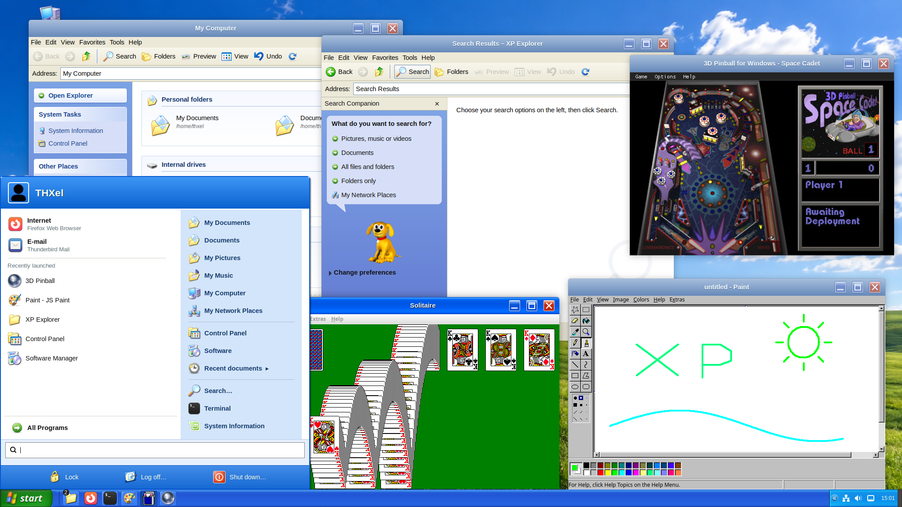
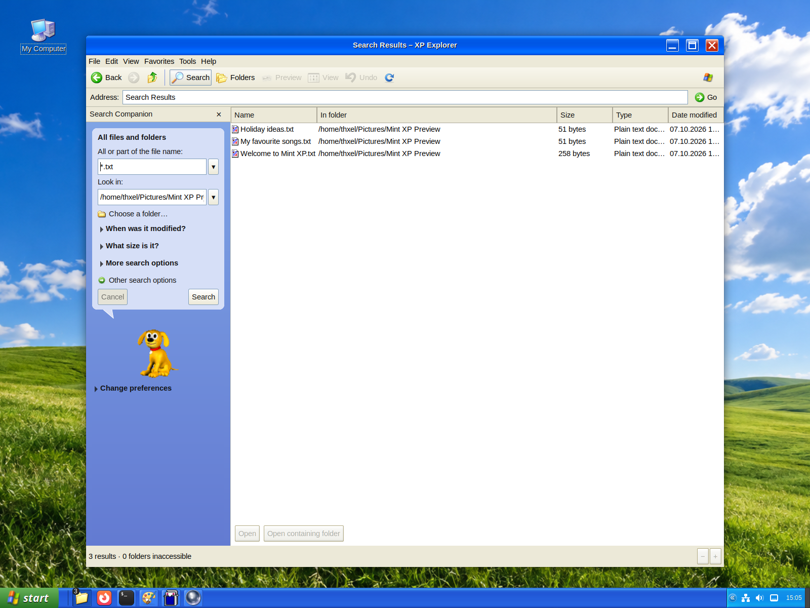
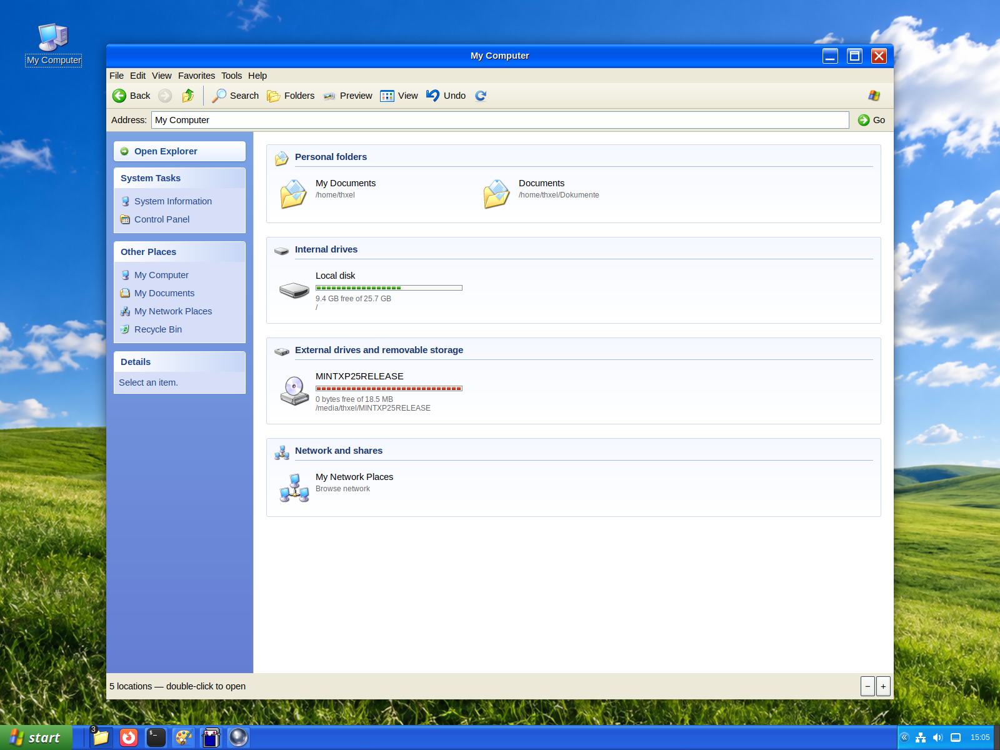
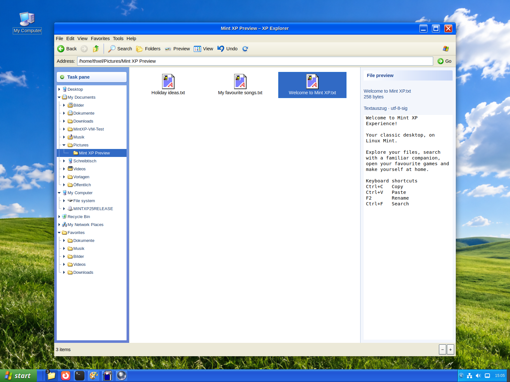
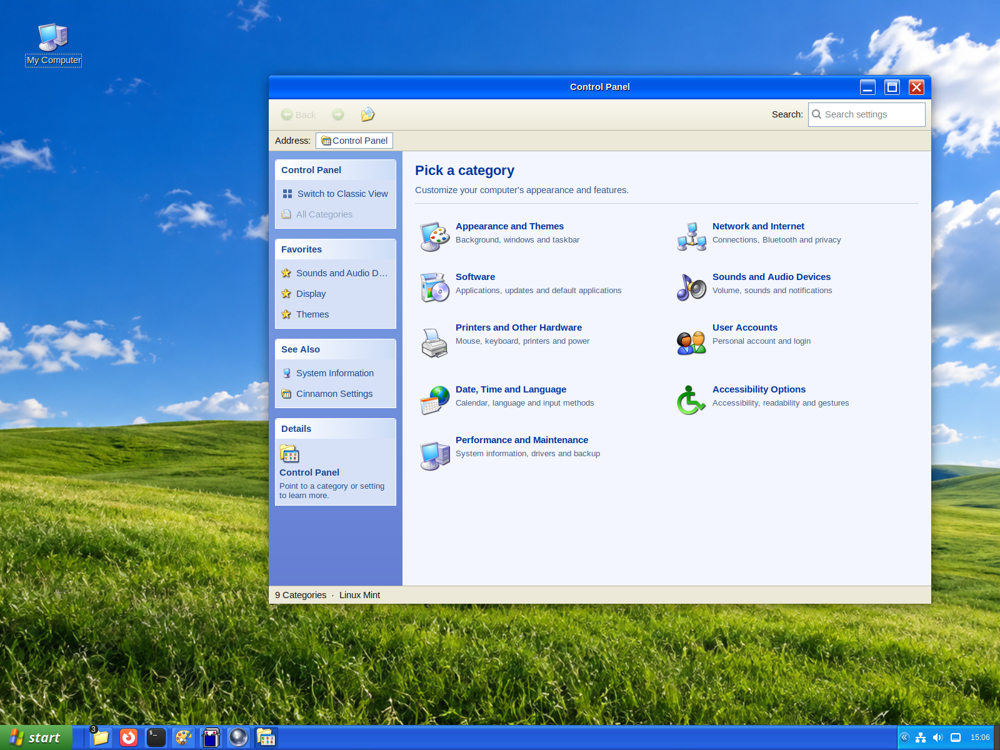
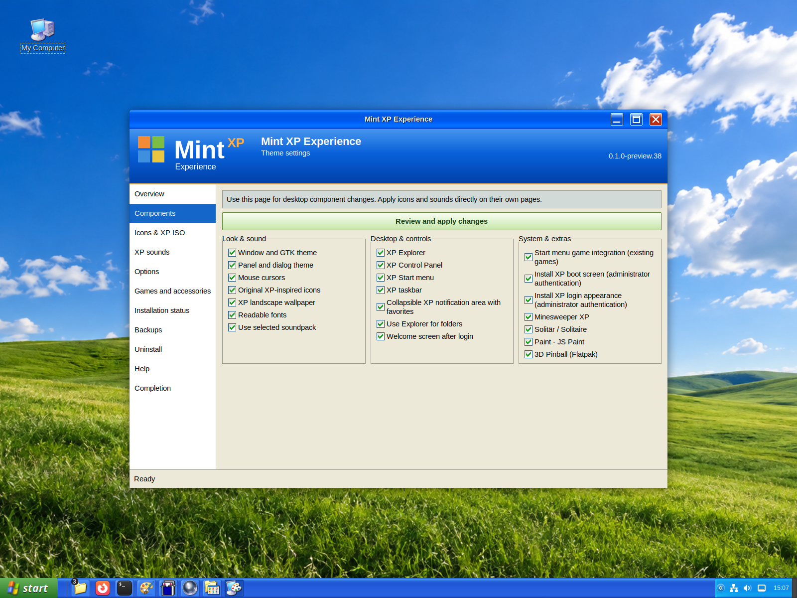
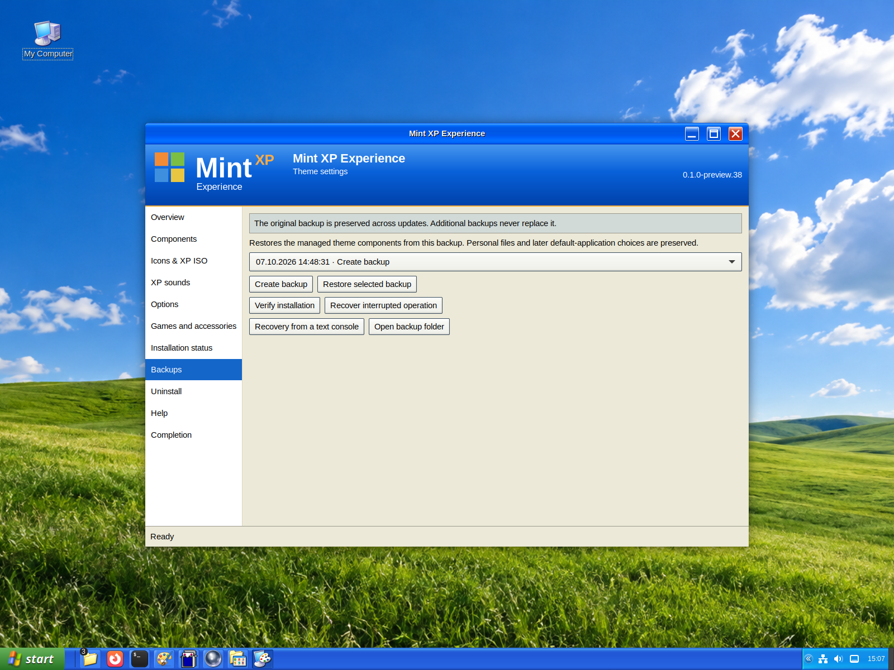

<p align="right"><strong>English</strong> · <a href="docs/INSTALL.de.md">🇩🇪 Deutsche Anleitung</a></p>

<div align="center">
  
  <h1>Mint XP Experience</h1>
  <p><strong>A little 2001. A lot of Linux Mint.</strong><br>
  Luna desktop • XP Explorer • Search Companion • Classic games • Reversible setup</p>
  <p>Created by <a href="https://github.com/THXel">THXel</a> · Community preview</p>
  <p><a href="https://github.com/THXel/mint-xp-experience/releases">⬇ Download the latest preview</a> · <a href="#installation">Installation</a> · <a href="#features">Features</a> · <a href="#gallery">Gallery</a> · <a href="#backup--restore">Backup & restore</a></p>
</div>

---

## Desktop preview



*A real Linux Mint virtual machine. Optional games and privately imported XP artwork are shown. Microsoft assets and third-party game payloads are not bundled with the package. Solitaire’s built-in win demo was triggered for the flying-card animation.*

**Target:** Linux Mint **22.3 Cinnamon**, Cinnamon **6.6.x**, **X11**. This is **Preview 38**, not a stable release. Try it in a VM or spare account first; see the [verified results and remaining limits](docs/RELEASE.md).

## Features

| Experience | What you get |
| --- | --- |
| 🟦 Luna desktop | Classic window borders, GTK styling, cursors, original project icons, optional landscape and readable fonts. |
| 📁 XP Explorer | Folder tree, favourites, file previews, context menus, keyboard shortcuts and drive capacity bars. Nemo remains installed. |
| 🔎 Search Companion | Search inside the Explorer window, with file categories, location, date and size filters. An original penguin is included; Rover can be privately imported from supported XP media. |
| 🟩 Start & taskbar | Two-column Start menu, cascading program categories, recent applications, orange attention indication and XP-style window actions. |
| ◀ Notification area | Collapsible tray, favourite icons, drag ordering and optional automatic collapse after inactivity. |
| ⚙ Control Panel | Categories, search and favourites, plus a dedicated theme manager. |
| 🎮 Games & accessories | Optional Minesweeper XP, Solitaire, 3D Pinball and Paint – JS Paint, installed from their documented upstream sources. |
| 💾 Reversible setup | Component selection, preinstallation backup, integrity checks, restore and uninstall. |

## Installation

### 1. Install the DEB

Download the `.deb` and `SHA256SUMS` from [Releases](https://github.com/THXel/mint-xp-experience/releases). Open the DEB with Linux Mint's package installer.

The package provides the setup assistant; installing it alone does not apply the desktop theme. The assistant opens in an active local graphical session, with a one-time login fallback. You can also launch **Mint XP Experience** from the application menu.

### 2. Choose your look

Choose the language and either:

- **Continue without an ISO:** use the included project icons and keep your existing sounds.
- **Import your own media:** select a supported XP ISO, icon/sound folder or archive you are entitled to use. Imports stay private and can be added after installation.

Select **Install everything** or choose individual components. Review optional downloads and any applet replacements. The assistant backs up your current configuration before applying changes. Boot/login styling requests administrator authentication separately; ordinary desktop setup runs as your user.

### 3. Make it yours

Open **Control Panel → Mint XP Experience** to change components, switch icons, import sounds or restore a backup. Sign out and back in when requested so updated Cinnamon applets load. The installer never closes your applications automatically.

[Detailed installation guide](docs/DEB.de.md) · [German introduction](docs/INSTALL.de.md) · [Games and accessories](docs/GAMES.md)

## Gallery

### Search, the familiar way



Choose a search category on the left; results appear in the same Explorer. Search can be cancelled, and folders can be opened from results. [Explorer guide and shortcuts](docs/EXPLORER.de.md).

### My Computer



Personal folders, internal drives, removable media and network locations are separated clearly. Capacity bars show how much space is left.

### Folders and file previews



Navigate with the folder tree and favourites, and preview supported files without opening another application. Existing folder names follow your own system.

### Your settings, together



Browse categories, search settings and pin favourites. The theme manager keeps appearance options, private imports and recovery in one place.

### Setup and recovery



The assistant and settings manager support **14 languages**, selected from the system locale or manually. Some older Explorer and Start menu strings are still untranslated; see [translation coverage](docs/TRANSLATING.md).

## Original icons, sounds and the dog

**An XP ISO is optional.** Included project icons and the penguin work without one. No soundpack is bundled; without an explicitly selected sound source, your current sound settings remain unchanged.

Original Microsoft icons, sound recordings, fonts, wallpaper and Rover animations are **not distributed in this repository**. Supported local imports extract resources as data and never execute Windows programs. An import does not grant usage rights. [Media import](docs/ISO-IMPORT.de.md) · [Sound imports](docs/SOUNDS.de.md) · [Sources and licences](docs/SOURCES.md).

Games and JS Paint are optional upstream downloads with their own notices. Existing installations are detected and protected. This project is not affiliated with Microsoft and is not a Windows compatibility layer.

## Backup & restore

The first installation saves an immutable baseline of managed files and settings. Updates retain that baseline. Uninstall restores package-managed changes, preserves unrelated files and keeps backups. Later conflicting edits are reported instead of silently overwritten.

Backups live under `~/.local/state/mint-xp-experience/` (or your configured `XDG_STATE_HOME`). They are **not a full-system backup**. If your desktop already had XP customisations, those are the baseline; keep any older backups too.

<details>
<summary>Show the backup and recovery screen</summary>



</details>

Use **Mint XP Experience → Backups / Uninstall** before removing the DEB. Boot/login rollback uses its own administrator prompt. [Recovery guide](docs/RECOVERY.md) · [Boot and login](docs/SESSION.de.md) · [VM test results](docs/VM-RESULTS.de.md).

## Development & support

From an extracted source release, start the assistant as your normal desktop user:

```sh
python3 -B launch.py
```

Run the automated checks:

```sh
python3 -B -m unittest discover -s tests -v
```

[Report a bug](https://github.com/THXel/mint-xp-experience/issues) with your Mint/Cinnamon version, package version and reproduction steps. Review screenshots and diagnostic files for private information before sharing them.

[Roadmap](docs/ROADMAP.md) · [Preview history](docs/PREVIEW-HISTORY.md) · [Release checks](docs/RELEASE.md) · [Translation help](docs/TRANSLATING.md)

Project code is **GPL-3.0-or-later**. Upstream components retain their own licence notices in [licenses](licenses/) and [sources](docs/SOURCES.md).
